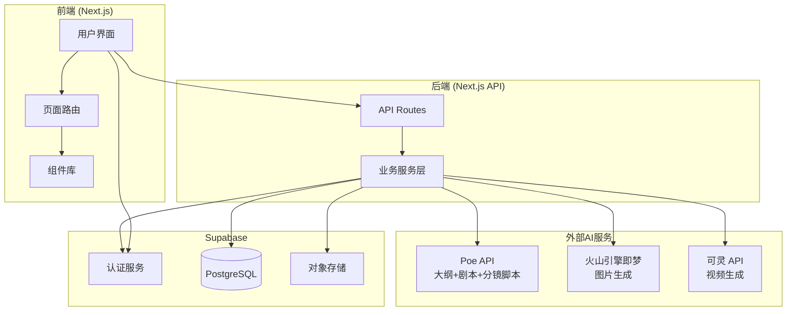
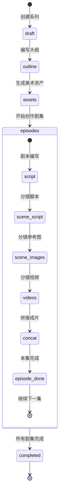
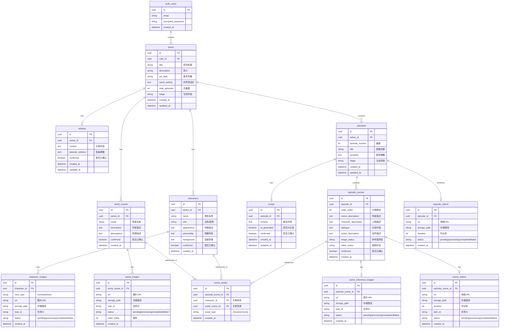
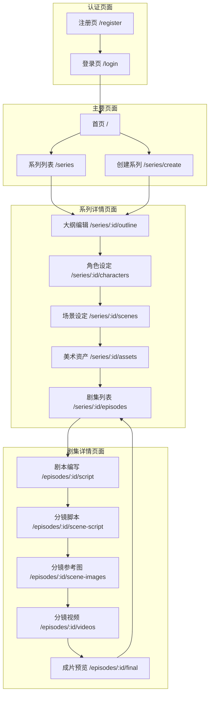

# AutoDrama - 架构设计文档

## 项目概述

**自动化短剧制作系统**

用户创建短剧系列 → 编写大纲(风格/角色/场景/世界观) → 生成美术资产 → 创作剧集(剧本→分镜脚本→分镜参考图→分镜视频→拼接成片)

---

## 核心概念

### 短剧系列 (Series)
一部完整的短剧作品，包含：
- 基本信息（标题、简介）
- 美术风格设定
- 世界观设定
- 主要角色设定
- 主要场景设定
- 多个剧集

### 大纲阶段
在创作任何剧集之前，必须完成：
1. **美术风格**: 整部短剧的视觉风格（动漫/写实/水彩等）
2. **世界观**: 故事发生的背景设定
3. **角色设定**: 主要角色的形象细节、性格特色
4. **场景设定**: 主要发生场景的描述
5. **剧集规划**: 总集数、每集梗概

### 美术资产
AI生成的固定视觉资产，用于保持整部短剧的一致性：
- **角色三视图**: 每个主要角色的正面、侧面、背面图
- **场景图**: 每个主要场景的多张参考图
- 这些资产在生成分镜视频时作为参考

### 剧集创作流程
1. **剧本编写** - 编写本集剧本内容
2. **分镜脚本编写** - 将剧本拆解为分镜脚本
3. **分镜参考图生成** - 为每个分镜生成参考图
4. **分镜视频生成** - 为每个分镜生成视频片段
5. **拼接成片** - 将所有分镜视频拼接为完整视频

---

## 技术栈

| 层级 | 技术选型 |
|-----|---------|
| 前端 | Next.js 15 (App Router) + TypeScript + Tailwind CSS |
| 后端 | Next.js API Routes |
| 数据库 | Supabase (PostgreSQL) |
| 认证 | Supabase Auth |
| 文件存储 | Supabase Storage |
| LLM | **Poe API** (大纲创作 + 剧本生成 + 分镜脚本生成) |
| 图片生成 | **火山引擎即梦 API** (角色三视图、场景图、分镜参考图) |
| 视频生成 | **可灵 API** (分镜视频生成) |
| 视频拼接 | FFmpeg (本地处理) |

---

## 1. 系统架构图



---

## 2. 核心业务流程图

```mermaid
flowchart TD
    Start([用户开始]) --> Auth{已登录?}
    Auth -->|否| Login[登录/注册]
    Auth -->|是| CreateSeries[创建短剧系列]
    Login --> CreateSeries

    %% 阶段1: 大纲创作
    CreateSeries --> OutlineEditor[大纲编辑器]
    OutlineEditor --> SetStyle[设定美术风格]
    SetStyle --> SetWorldView[设定世界观]
    SetWorldView --> SetCharacters[设定角色]
    SetCharacters --> SetScenes[设定场景]
    SetScenes --> SetEpisodes[规划剧集]
    SetEpisodes --> ConfirmOutline{确认大纲?}
    ConfirmOutline -->|不满意| OutlineEditor
    ConfirmOutline -->|满意| GenerateAssets[生成美术资产]

    %% 阶段2: 美术资产生成
    GenerateAssets --> GenCharImages[生成角色三视图]
    GenCharImages --> GenSceneImages[生成场景参考图]
    GenSceneImages --> ReviewAssets{审核资产}
    ReviewAssets -->|不满意| RegenerateAssets[重新生成]
    RegenerateAssets --> GenCharImages
    ReviewAssets -->|满意| ConfirmAssets[确认资产]
    ConfirmAssets --> SelectEpisode[选择剧集]

    %% 阶段3: 剧集创作循环
    SelectEpisode --> ScriptEditor[剧本编写]
    ScriptEditor --> WriteScript{编写剧本}
    WriteScript -->|手动| ManualScript[手动输入]
    WriteScript -->|AI辅助| AIScript[AI生成]
    AIScript --> EditScript[编辑确认]
    ManualScript --> EditScript
    EditScript --> ConfirmScript{确认剧本?}
    ConfirmScript -->|不满意| ScriptEditor
    ConfirmScript -->|满意| GenerateSceneScript[生成分镜脚本]

    %% 阶段4: 分镜脚本生成
    GenerateSceneScript --> AIProcessScenes[AI拆解分镜脚本]
    AIProcessScenes --> LinkAssets[关联美术资产]
    LinkAssets --> EditSceneScript[编辑分镜脚本]
    EditSceneScript --> ConfirmSceneScript{确认分镜脚本?}
    ConfirmSceneScript -->|不满意| RegenerateSceneScript[重新生成]
    RegenerateSceneScript --> AIProcessScenes
    ConfirmSceneScript -->|满意| GenerateSceneImages[生成分镜参考图]

    %% 阶段5: 分镜参考图生成
    GenerateSceneImages --> GenSceneImgLoop[批量生成分镜参考图]
    GenSceneImgLoop --> PollSceneImages[轮询图片状态]
    PollSceneImages --> ShowSceneImages[显示所有参考图]
    ShowSceneImages --> ReviewSceneImages{确认参考图}
    ReviewSceneImages -->|不满意| RegenerateSceneImage[重新生成]
    RegenerateSceneImage --> PollSceneImages
    ReviewSceneImages -->|满意| GenerateVideos[生成分镜视频]

    %% 阶段6: 分镜视频生成
    GenerateVideos --> VideoLoop[批量生成分镜视频]
    VideoLoop --> PollVideos[轮询视频状态]
    PollVideos --> ShowVideos[显示所有视频]
    ShowVideos --> ReviewVideos{确认视频}
    ReviewVideos -->|不满意| RegenerateVideo[重新生成]
    RegenerateVideo --> PollVideos
    ReviewVideos -->|满意| ConcatEpisode[拼接成片]

    %% 阶段7: 剧集完成
    ConcatEpisode --> EpisodeComplete{剧集完成?}
    EpisodeComplete -->|否| SelectEpisode
    EpisodeComplete -->|是| SeriesComplete[系列完成]
    SeriesComplete --> End([结束])
```



### 项目阶段流转



---

## 3. 数据模型图



### 状态流转说明

| 字段 | 可能值 | 说明 |
|-----|-------|------|
| series.stage | draft | 刚创建 |
| | outline | 大纲阶段 |
| | assets | 美术资产阶段 |
| | episodes | 剧集创作阶段 |
| | completed | 全部完成 |
| episode.stage | draft | 刚创建 |
| | script | 剧本阶段 |
| | scene_script | 分镜脚本阶段 |
| | scene_images | 分镜参考图阶段 |
| | videos | 分镜视频阶段 |
| | completed | 本集完成 |
| character_image.status | pending | 等待生成 |
| | processing | 生成中 |
| | completed | 已完成 |
| | failed | 生成失败 |
| scene_reference_image.status | pending/processing/completed/failed |
| scene_video.status | pending/processing/completed/failed |

---

## 4. 页面结构图



---

## 5. API 设计

### 系列管理 API

| 方法 | 路径 | 描述 |
|-----|------|-----|
| POST | /api/series | 创建系列 |
| GET | /api/series | 获取系列列表 |
| GET | /api/series/:id | 获取系列详情 |
| PATCH | /api/series/:id | 更新系列 |
| DELETE | /api/series/:id | 删除系列 |

### 大纲 API

| 方法 | 路径 | 描述 |
|-----|------|-----|
| GET | /api/series/:id/outline | 获取大纲 |
| POST | /api/series/:id/outline | 创建/更新大纲 |
| POST | /api/generate/outline | AI生成大纲 (Poe) |
| POST | /api/series/:id/outline/confirm | 确认大纲 |

### 角色 API

| 方法 | 路径 | 描述 |
|-----|------|-----|
| GET | /api/series/:id/characters | 获取角色列表 |
| POST | /api/characters | 创建角色 |
| PATCH | /api/characters/:id | 更新角色 |
| DELETE | /api/characters/:id | 删除角色 |
| POST | /api/characters/:id/confirm | 确认角色 |

### 场景 API

| 方法 | 路径 | 描述 |
|-----|------|-----|
| GET | /api/series/:id/world-scenes | 获取场景列表 |
| POST | /api/world-scenes | 创建场景 |
| PATCH | /api/world-scenes/:id | 更新场景 |
| DELETE | /api/world-scenes/:id | 删除场景 |
| POST | /api/world-scenes/:id/confirm | 确认场景 |

### 美术资产 API (火山引擎即梦)

| 方法 | 路径 | 描述 |
|-----|------|-----|
| POST | /api/generate/character-image/:characterId | 生成角色图片 |
| POST | /api/generate/scene-image/:sceneId | 生成场景图片 |
| GET | /api/generate/image/:taskId | 查询图片生成状态 |
| POST | /api/series/:id/assets/generate-all | 批量生成所有资产 |
| POST | /api/series/:id/assets/confirm-all | 确认所有资产 |

### 剧集 API

| 方法 | 路径 | 描述 |
|-----|------|-----|
| GET | /api/series/:id/episodes | 获取剧集列表 |
| POST | /api/series/:id/episodes | 创建剧集 |
| GET | /api/episodes/:id | 获取剧集详情 |
| PATCH | /api/episodes/:id | 更新剧集 |
| DELETE | /api/episodes/:id | 删除剧集 |

### 剧本 API (Poe)

| 方法 | 路径 | 描述 |
|-----|------|-----|
| GET | /api/episodes/:id/script | 获取剧本 |
| POST | /api/episodes/:id/script | 创建/更新剧本 |
| POST | /api/generate/script | AI生成剧本 (Poe) |
| POST | /api/episodes/:id/script/confirm | 确认剧本 |

### 分镜脚本 API (Poe)

| 方法 | 路径 | 描述 |
|-----|------|-----|
| GET | /api/episodes/:id/scenes | 获取分镜脚本列表 |
| POST | /api/generate/scene-script | AI生成分镜脚本 (Poe) |
| PATCH | /api/episode-scenes/:id | 修改分镜脚本 |
| POST | /api/episode-scenes/:id/confirm | 确认分镜脚本 |
| POST | /api/episodes/:id/scenes/confirm-all | 确认所有分镜脚本 |

### 分镜参考图 API (火山引擎即梦)

| 方法 | 路径 | 描述 |
|-----|------|-----|
| POST | /api/generate/scene-reference-image/:sceneId | 生成分镜参考图 |
| GET | /api/generate/scene-reference-image/:taskId | 查询图片状态 |
| POST | /api/generate/scene-reference-images | 批量生成分镜参考图 |
| POST | /api/episode-scenes/:id/confirm-image | 确认参考图 |
| POST | /api/episodes/:id/scene-images/confirm-all | 确认所有参考图 |

### 分镜视频 API (可灵)

| 方法 | 路径 | 描述 |
|-----|------|-----|
| POST | /api/generate/video/:sceneId | 创建视频任务 (可灵) |
| GET | /api/generate/video/:taskId | 查询视频状态 |
| POST | /api/generate/videos | 批量生成视频 |
| POST | /api/episode-scenes/:id/confirm-video | 确认视频 |
| POST | /api/episodes/:id/videos/confirm-all | 确认所有视频 |

### 剧集成片 API

| 方法 | 路径 | 描述 |
|-----|------|-----|
| POST | /api/episodes/:id/concat | 拼接剧集成片 |
| GET | /api/episodes/:id/concat | 查询拼接状态 |

---

## 6. 外部 API 集成

### 6.1 Poe API (大纲 + 剧本 + 分镜脚本生成)

```
端点: https://api.poe.com/v1/chat/completions
认证: Bearer Token
格式: OpenAI 兼容格式
```

**请求示例:**
```python
import requests

url = "https://api.poe.com/v1/chat/completions"
headers = {
    "Content-Type": "application/json",
    "Authorization": f"Bearer {api_key}"
}
data = {
    "model": "gemini-3-flash",  # 或其他模型
    "messages": [
        {"role": "user", "content": "你的提示词"}
    ]
}
response = requests.post(url, headers=headers, json=data)
```

#### 大纲生成 Prompt

```
你是一位专业的短剧策划师。根据用户提供的信息，生成一部短剧系列的大纲。

你需要提供：
1. 美术风格建议（动漫/写实/水彩等，并说明理由）
2. 世界观设定（故事背景、时代、社会环境）
3. 主要角色设定（每个角色的外貌、性格、背景）
4. 主要场景设定（故事发生的主要地点）
5. 剧集规划（每集的标题和剧情梗概）

用户输入：
主题：{user_theme}
风格偏好：{user_style_preference}
预计集数：{episode_count}
```

#### 剧本生成 Prompt

```
你是一位专业的短剧编剧。根据大纲和本集梗概，编写第{episode_number}集的剧本。

系列信息：
- 美术风格：{art_style}
- 世界观：{world_setting}
- 主要角色：{characters}

本集梗概：{episode_synopsis}

要求：
1. 剧本时长约 2-5 分钟
2. 包含清晰的场景描述和人物对话
3. 情节紧凑，有起承转合
4. 输出格式为标准剧本格式
```

#### 分镜脚本生成 Prompt

```
你是一位专业的分镜师。将以下剧本拆解成多个分镜脚本。

系列信息：
- 美术风格：{art_style}
- 可用角色：{characters}
- 可用场景：{world_scenes}

对于每个分镜，你需要提供：
1. scene_id: 关联的场景ID（从可用场景中选择）
2. character_ids: 出现的角色ID列表
3. scene_description: 场景描述（环境、时间、氛围）
4. character_description: 人物描述（外貌、表情、动作、服装）
5. dialogue: 对话内容（说话人和台词）
6. action_description: 动作描述（用于视频生成）
7. camera_angle: 镜头角度（特写/中景/远景等）

请以 JSON 格式输出分镜列表。

剧本：
{script_content}
```

### 6.2 火山引擎即梦 API (图片生成)

```
端点: https://visual.volcengineapi.com
认证: AWS Signature V4 (access_key + secret_key)
模型: jimeng_t2i_v40
```

**API 调用流程:**

1. **提交任务**
```
POST https://visual.volcengineapi.com?Action=CVSync2AsyncSubmitTask&Version=2022-08-31

Body:
{
    "req_key": "jimeng_t2i_v40",
    "prompt": "生成图片描述",
    "scale": 0.5
}

Response:
{
    "code": 10000,
    "data": {"task_id": "xxx"},
    "message": "Success"
}
```

2. **查询结果**
```
POST https://visual.volcengineapi.com?Action=CVSync2AsyncGetResult&Version=2022-08-31

Body:
{
    "req_key": "jimeng_t2i_v40",
    "task_id": "xxx",
    "req_json": "{\"logo_info\":{\"add_logo\":false},\"return_url\":true}"
}

Response:
{
    "code": 10000,
    "data": {
        "status": "done",  // in_queue, generating, done
        "image_urls": ["https://..."]
    }
}
```

**角色图片生成 Prompt 模板:**
```
生成角色 "{character_name}" 的{view_type}视图。
角色描述：{character_appearance}
美术风格：{art_style}
要求：清晰展示角色特征，适合作为动画制作参考图。
```

**场景图片生成 Prompt 模板:**
```
生成场景 "{scene_name}" 的参考图。
场景描述：{scene_description}
氛围：{atmosphere}
美术风格：{art_style}
```

**分镜参考图生成 Prompt 模板:**
```
生成分镜参考图。
场景：{scene_description}
人物：{character_description}
动作：{action_description}
美术风格：{art_style}
```

### 6.3 可灵 API (视频生成)

```
端点: 待确认 (可灵 API 文档)
认证: 待确认
```

**请求示例:**
```json
{
  "model": "kling-video",
  "prompt": "{scene_description}，{character_description}，{action_description}",
  "image_url": "可选的参考图URL",
  "duration": 5
}
```

**API 调用流程:**
1. 提交任务，获取 task_id
2. 轮询查询任务状态
3. 任务完成后获取视频URL

---

## 7. 环境变量

```env
# Supabase
NEXT_PUBLIC_SUPABASE_URL=your_supabase_url
NEXT_PUBLIC_SUPABASE_ANON_KEY=your_supabase_anon_key
SUPABASE_SERVICE_ROLE_KEY=your_service_role_key

# Poe API
POE_API_KEY=your_poe_api_key

# 火山引擎即梦
VOLCENGINE_ACCESS_KEY=your_access_key
VOLCENGINE_SECRET_KEY=your_secret_key

# 可灵 API
KLING_API_KEY=your_kling_api_key
```

---

## 8. 目录结构

```
autodrama/
├── src/
│   ├── app/
│   │   ├── (auth)/
│   │   │   ├── login/page.tsx
│   │   │   └── register/page.tsx
│   │   ├── (main)/
│   │   │   ├── page.tsx                    # 首页
│   │   │   ├── series/
│   │   │   │   ├── page.tsx                # 系列列表
│   │   │   │   ├── create/page.tsx         # 创建系列
│   │   │   │   └── [id]/
│   │   │   │       ├── outline/page.tsx    # 大纲编辑
│   │   │   │       ├── characters/page.tsx # 角色设定
│   │   │   │       ├── scenes/page.tsx     # 场景设定
│   │   │   │       ├── assets/page.tsx     # 美术资产
│   │   │   │       └── episodes/page.tsx   # 剧集列表
│   │   │   └── episodes/
│   │   │       └── [id]/
│   │   │           ├── script/page.tsx         # 剧本编写
│   │   │           ├── scene-script/page.tsx   # 分镜脚本
│   │   │           ├── scene-images/page.tsx   # 分镜参考图
│   │   │           ├── videos/page.tsx         # 分镜视频
│   │   │           └── final/page.tsx          # 成片预览
│   │   ├── api/
│   │   │   ├── series/
│   │   │   ├── episodes/
│   │   │   ├── characters/
│   │   │   ├── world-scenes/
│   │   │   ├── generate/
│   │   │   ├── episode-scenes/
│   │   │   └── ...
│   │   ├── layout.tsx
│   │   ├── error.tsx
│   │   ├── not-found.tsx
│   │   └── loading.tsx
│   ├── components/
│   │   ├── auth/
│   │   ├── layout/
│   │   ├── series/
│   │   ├── character/
│   │   ├── scene/
│   │   ├── asset/
│   │   ├── episode/
│   │   ├── video/
│   │   └── ui/
│   ├── lib/
│   │   ├── supabase/
│   │   ├── ai/
│   │   │   ├── poe.ts              # Poe API 封装
│   │   │   ├── jimeng.ts           # 火山引擎即梦封装
│   │   │   └── kling.ts            # 可灵 API 封装
│   │   ├── db/
│   │   ├── video/
│   │   └── utils.ts
│   └── types/
├── supabase/
│   └── migrations/
├── public/
├── .env.local
├── package.json
├── tailwind.config.ts
├── tsconfig.json
└── next.config.ts
```