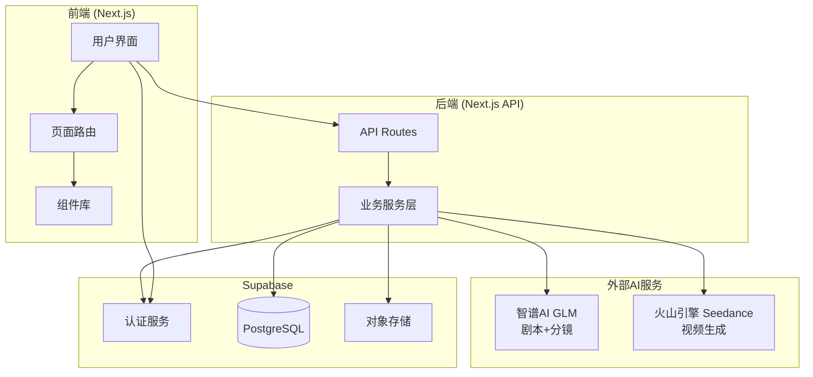
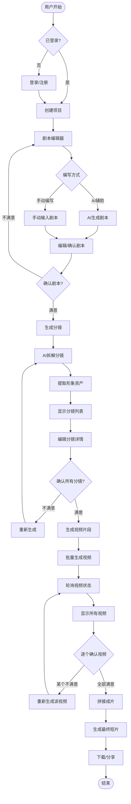
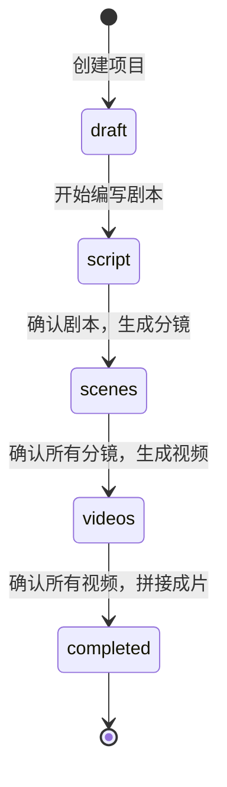
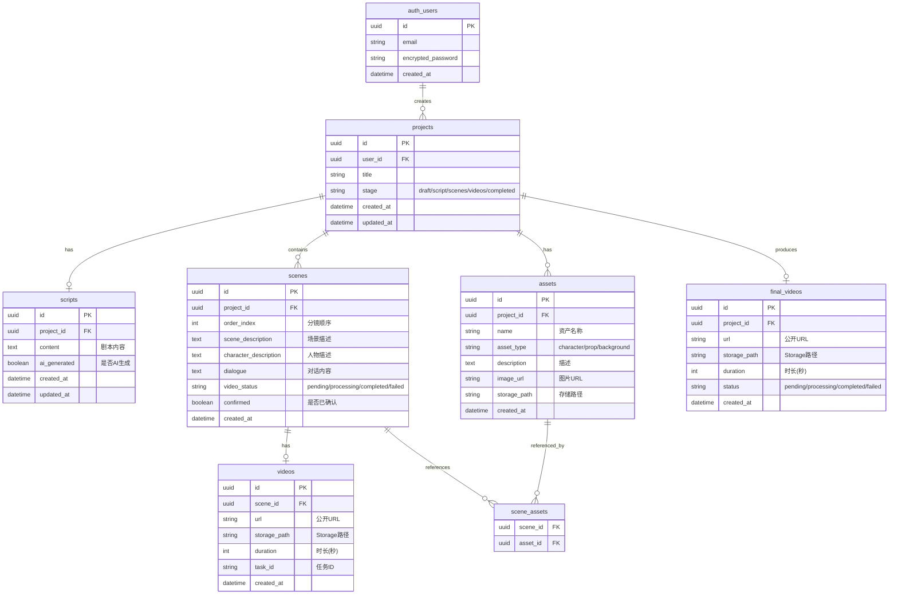
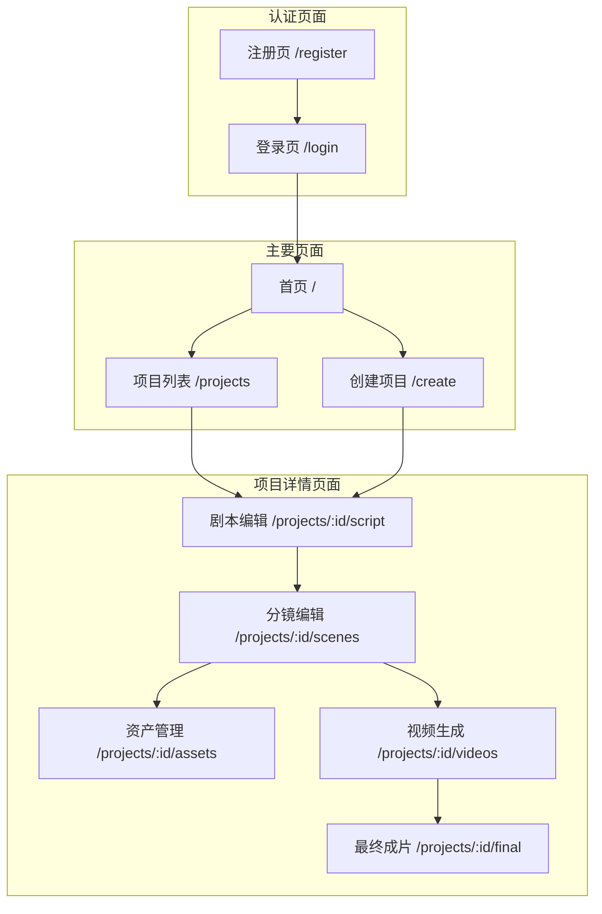

# AutoDrama - 架构设计文档

## 项目概述

**自动化短剧制作系统**

用户输入主题/创意 → AI编写剧本 → AI生成分镜(含资产) → AI生成视频片段 → 自动拼接成片

---

## 技术栈

| 层级 | 技术选型 |
|-----|---------|
| 前端 | Next.js 15 (App Router) + TypeScript + Tailwind CSS |
| 后端 | Next.js API Routes |
| 数据库 | Supabase (PostgreSQL) |
| 认证 | Supabase Auth |
| 文件存储 | Supabase Storage |
| LLM | 智谱AI GLM-4 (剧本创作 + 分镜生成) |
| 视频生成 | 火山引擎 Seedance |
| 视频拼接 | FFmpeg.wasm 或云端服务 |

---

## 1. 系统架构图



---

## 2. 核心业务流程图



### 项目阶段流转



---

## 3. 数据模型图



### 状态流转说明

| 字段 | 可能值 | 说明 |
|-----|-------|------|
| project.stage | draft | 刚创建 |
| | script | 剧本阶段 |
| | scenes | 分镜阶段 |
| | videos | 视频阶段 |
| | completed | 全部完成 |
| scene.video_status | pending | 等待生成视频 |
| | processing | 视频生成中 |
| | completed | 视频已生成 |
| | failed | 生成失败 |
| final_video.status | pending | 等待拼接 |
| | processing | 拼接中 |
| | completed | 拼接完成 |
| | failed | 拼接失败 |

---

## 4. 页面结构图



---

## 5. API 设计

### 项目 API

| 方法 | 路径 | 描述 |
|-----|------|-----|
| POST | /api/projects | 创建项目 |
| GET | /api/projects | 获取项目列表 |
| GET | /api/projects/:id | 获取项目详情 |
| PATCH | /api/projects/:id | 更新项目 |
| DELETE | /api/projects/:id | 删除项目 |

### 剧本 API

| 方法 | 路径 | 描述 |
|-----|------|-----|
| GET | /api/projects/:id/script | 获取剧本 |
| POST | /api/projects/:id/script | 创建/更新剧本 |
| POST | /api/generate/script | AI生成剧本 |

### 分镜 API

| 方法 | 路径 | 描述 |
|-----|------|-----|
| GET | /api/projects/:id/scenes | 获取分镜列表 |
| PATCH | /api/scenes/:id | 修改分镜 |
| POST | /api/scenes/:id/confirm | 确认分镜 |
| POST | /api/scenes/confirm-all | 确认所有分镜 |
| POST | /api/generate/scenes | AI生成分镜 |

### 资产 API

| 方法 | 路径 | 描述 |
|-----|------|-----|
| GET | /api/projects/:id/assets | 获取资产列表 |
| POST | /api/assets | 创建资产 |
| PATCH | /api/assets/:id | 更新资产 |
| DELETE | /api/assets/:id | 删除资产 |

### 视频 API

| 方法 | 路径 | 描述 |
|-----|------|-----|
| POST | /api/generate/video/:sceneId | 为单个分镜创建视频任务 |
| GET | /api/generate/video/:taskId | 查询视频任务状态 |
| POST | /api/generate/videos | 批量创建所有分镜视频任务 |
| POST | /api/videos/:id/confirm | 确认视频 |
| POST | /api/videos/confirm-all | 确认所有视频 |

### 拼接 API

| 方法 | 路径 | 描述 |
|-----|------|-----|
| POST | /api/projects/:id/concat | 触发拼接任务 |
| GET | /api/projects/:id/concat | 查询拼接状态 |

---

## 6. 外部 API 集成

### 6.1 智谱AI GLM (剧本创作 + 分镜生成)

```
端点: https://open.bigmodel.cn/api/paas/v4/chat/completions
认证: Bearer Token
模型: glm-4
```

#### 剧本创作 Prompt

```
你是一位专业的短剧编剧。根据用户提供的主题/创意，编写一个短剧剧本。

要求：
1. 剧本时长约 1-3 分钟
2. 包含清晰的场景描述和人物对话
3. 情节紧凑，有起承转合
4. 输出格式为标准剧本格式

主题：{user_input}
```

#### 分镜生成 Prompt

```
你是一位专业的分镜师。将以下剧本拆解成多个分镜。

对于每个分镜，你需要提供：
1. scene_description: 场景描述（环境、时间、氛围）
2. character_description: 人物描述（外貌、表情、动作、服装）
3. dialogue: 对话内容（说话人和台词）
4. assets: 出现的形象资产列表，每个资产包含：
   - name: 资产名称
   - type: 类型 (character/prop/background)
   - description: 详细描述

请以 JSON 格式输出分镜列表。

剧本：
{script_content}
```

### 6.2 火山引擎 Seedance (视频生成)

```
创建任务: POST https://ark.cn-beijing.volces.com/api/v3/contents/generations/tasks
查询任务: GET https://ark.cn-beijing.volces.com/api/v3/contents/generations/tasks/{task_id}
认证: Bearer Token
模型: doubao-seedance-1-5-pro-251215
```

请求示例:
```json
{
  "model": "doubao-seedance-1-5-pro-251215",
  "content": [
    {
      "type": "text",
      "text": "场景描述 + 人物描述 + 动作描述"
    }
  ],
  "generate_audio": true,
  "ratio": "adaptive",
  "duration": 5,
  "watermark": false
}
```

---

## 7. 环境变量

```env
# Supabase
NEXT_PUBLIC_SUPABASE_URL=your_supabase_url
NEXT_PUBLIC_SUPABASE_ANON_KEY=your_supabase_anon_key
SUPABASE_SERVICE_ROLE_KEY=your_service_role_key

# 智谱AI
ZHIPU_API_KEY=your_zhipu_api_key

# 火山引擎
VOLC_API_KEY=your_volc_api_key
```

---

## 8. 目录结构

```
autodrama/
├── src/
│   ├── app/
│   │   ├── (auth)/
│   │   │   ├── login/page.tsx
│   │   │   └── register/page.tsx
│   │   ├── (main)/
│   │   │   ├── page.tsx              # 首页
│   │   │   ├── projects/page.tsx     # 项目列表
│   │   │   ├── create/page.tsx       # 创建项目
│   │   │   └── projects/[id]/
│   │   │       ├── script/page.tsx   # 剧本编辑
│   │   │       ├── scenes/page.tsx   # 分镜编辑
│   │   │       ├── assets/page.tsx   # 资产管理
│   │   │       ├── videos/page.tsx   # 视频生成
│   │   │       └── final/page.tsx    # 最终成片
│   │   ├── api/
│   │   │   ├── projects/
│   │   │   ├── generate/
│   │   │   ├── scenes/
│   │   │   ├── assets/
│   │   │   └── videos/
│   │   ├── layout.tsx
│   │   ├── error.tsx
│   │   ├── not-found.tsx
│   │   └── loading.tsx
│   ├── components/
│   │   ├── auth/
│   │   ├── layout/
│   │   ├── project/
│   │   ├── script/
│   │   ├── scene/
│   │   ├── asset/
│   │   ├── video/
│   │   └── ui/
│   ├── lib/
│   │   ├── supabase/
│   │   ├── ai/
│   │   ├── db/
│   │   ├── video/
│   │   └── utils.ts
│   └── types/
├── supabase/
│   └── migrations/
├── public/
├── .env.local
├── package.json
├── tailwind.config.ts
├── tsconfig.json
└── next.config.ts
```