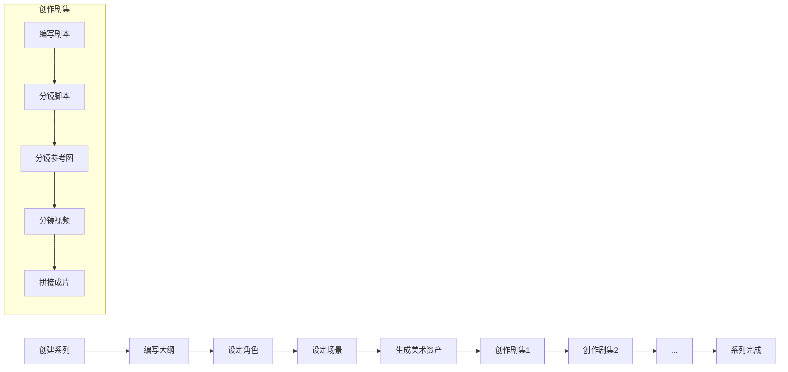

# AutoDrama - 任务规划

## 项目概述

构建一个自动化短剧制作流水线系统：
**系列大纲 → 角色场景设定 → 美术资产生成 → 剧集创作(剧本→分镜脚本→分镜参考图→分镜视频→拼接成片)**

---

## 核心概念

### 短剧系列 (Series)
一部完整的短剧作品，包含多个剧集。在开始创作之前，需要完成：
1. **美术风格设定** - 整部短剧的视觉风格
2. **世界观设定** - 故事发生的背景
3. **角色设定** - 主要角色的形象细节与性格特色
4. **场景设定** - 主要发生场景
5. **剧集规划** - 总集数、每集梗概

### 美术资产
AI生成的固定视觉资产，用于保持整部短剧的一致性：
- **角色三视图** - 每个主要角色的正面、侧面、背面图
- **场景参考图** - 每个主要场景的多张图片

### 剧集创作流程
1. **剧本编写** - 编写本集剧本内容
2. **分镜脚本编写** - 将剧本拆解为分镜脚本
3. **分镜参考图生成** - 为每个分镜生成参考图
4. **分镜视频生成** - 为每个分镜生成视频片段
5. **拼接成片** - 将所有分镜视频拼接为完整视频

---

## 外部 API 集成

| 功能 | API | 说明 |
|-----|-----|-----|
| 大模型 | **Poe API** | 大纲生成、剧本生成、分镜脚本生成 |
| 图片生成 | **火山引擎即梦** | 角色三视图、场景图、分镜参考图 |
| 视频生成 | **可灵 API** | 分镜视频生成 |

---

## 核心差异点（对比参考项目）

| 参考项目 (hello-nextjs) | AutoDrama |
|------------------------|-----------|
| 单个项目 = 单个剧本 | 系列 → 多个剧集 |
| 故事 → 分镜描述 → 图片 → 视频 | 大纲 → 角色/场景 → 资产 → 剧集 |
| 无资产管理 | 需要资产管理（角色三视图、场景图） |
| 智谱AI + 火山引擎Seedream/Seedance | Poe + 火山引擎即梦 + 可灵 |
| 剧本 → 分镜 → 视频 | 剧本 → 分镜脚本 → 分镜参考图 → 分镜视频 → 成片 |

---

## 技术架构

```
前端: Next.js 15 + TypeScript + Tailwind CSS
后端: Next.js API Routes
数据库: Supabase (PostgreSQL)
文件存储: Supabase Storage
LLM: Poe API (大纲创作 + 剧本生成 + 分镜脚本生成)
图片生成: 火山引擎即梦 API (角色三视图、场景图、分镜参考图)
视频生成: 可灵 API
视频拼接: FFmpeg.wasm 或云端服务
```

---

## 阶段划分

### Phase 1: 基础架构 (任务 1-8)
- 项目初始化与配置
- 数据库设计（系列+剧集相关表）
- Supabase 客户端封装
- 用户认证系统

### Phase 2: AI服务集成 (任务 9-12)
- Poe API (大纲+剧本+分镜脚本生成)
- 火山引擎即梦 API (角色三视图、场景图、分镜参考图)
- 可灵 API (视频生成)
- 视频拼接服务

### Phase 3: 数据层 (任务 13-23)
- 系列数据访问
- 大纲数据访问
- 角色/场景数据访问
- 美术资产数据访问
- 剧集数据访问
- 剧本/分镜脚本/参考图/视频数据访问

### Phase 4: API层 (任务 24-34)
- 系列管理 API
- 大纲 API
- 角色/场景 API
- 美术资产生成 API
- 剧集管理 API
- 剧本 API
- 分镜脚本 API
- 分镜参考图 API
- 分镜视频 API
- 成片拼接 API

### Phase 5: 前端UI (任务 35-50)
- 首页与导航
- 系列列表与创建
- 大纲编辑器
- 角色设定页面
- 场景设定页面
- 美术资产页面
- 剧集列表页面
- 剧本编写页面
- 分镜脚本页面
- 分镜参考图页面
- 分镜视频页面
- 成片预览页面
- 阶段指示器
- 状态更新

### Phase 6: 完善与测试 (任务 51-54)
- 错误处理
- Loading状态
- 响应式设计
- 最终测试

---

## 数据模型概览

```
series (短剧系列)
├── id, user_id, title, description
├── art_style (美术风格)
├── world_setting (世界观)
├── total_episodes (总集数)
└── stage (阶段)

outlines (大纲)
├── id, series_id
├── content (大纲内容)
└── episode_outlines (各集梗概 JSON)

characters (角色)
├── id, series_id
├── name, role, appearance, personality, background
└── confirmed

character_images (角色图片)
├── id, character_id
├── view_type (front/side/back)
└── url, task_id, status

world_scenes (场景)
├── id, series_id
├── name, description, atmosphere
└── confirmed

scene_images (场景图片)
├── id, world_scene_id
├── url, task_id, status, order_index

episodes (剧集)
├── id, series_id
├── episode_number, title, synopsis
└── stage

scripts (剧本)
├── id, episode_id
├── content, ai_generated, confirmed

episode_scenes (分镜脚本)
├── id, episode_id
├── order_index, scene_description, character_description
├── dialogue, action_description
├── image_status, video_status, confirmed

scene_reference_images (分镜参考图)
├── id, episode_scene_id
├── url, task_id, status

scene_assets (分镜资产关联)
├── episode_scene_id, character_id, world_scene_id

scene_videos (分镜视频)
├── id, episode_scene_id
├── url, duration, task_id, status

episode_videos (剧集成片)
├── id, episode_id
├── url, duration, status
```

---

## 用户流程



---

## 自动开发 Task 执行工作流（强制执行）

每个 Task 必须按照以下顺序完整执行，缺一不可：

### Step 1: 代码编写
- 阅读 task.json 中任务描述和步骤
- 实现功能代码
- 确保代码符合项目规范

### Step 2: Git 提交
- **在测试之前先提交代码**
- 使用有意义的 commit message
- 确保 commit 包含所有相关更改

### Step 3: 测试验证
- 运行 `npm run lint` 检查代码规范
- 运行 `npm run build` 确保构建成功
- **UI 修改必须在浏览器中测试**
- 验证功能正常工作

### Step 4: 更新日志
- 更新 `progress.md` 详细记录工作内容
- 更新 `progress.txt` 简要记录

### Step 5: 更新任务状态
- 将 task.json 中对应任务的 `"passes": false` 改为 `"passes": true`

### Step 6: 最终提交
- 将所有更新（代码、日志、task.json）一起提交
- 推送到远程仓库

```
Task 完成检查清单:
□ 代码编写完成
□ Git 已提交
□ 测试验证通过
□ progress.md 已更新
□ progress.txt 已更新
□ task.json passes 已改为 true
□ 最终提交并推送
```

---

## Git 工作流

每次完成任务后：
1. 更新 task.json (passes: true)
2. 更新 progress.txt
3. 提交所有更改：
   ```bash
   git add .
   git commit -m "[任务标题] - completed"
   git push
   ```

---

## 阻塞处理

如果遇到以下情况需要人工介入：
- .env.local 需要真实 API 密钥
- Supabase 项目需要创建
- 外部服务需要开通

阻塞时：
- 不提交 git
- 不标记 passes: true
- 在 progress.txt 记录阻塞原因
- 输出清晰的阻塞信息